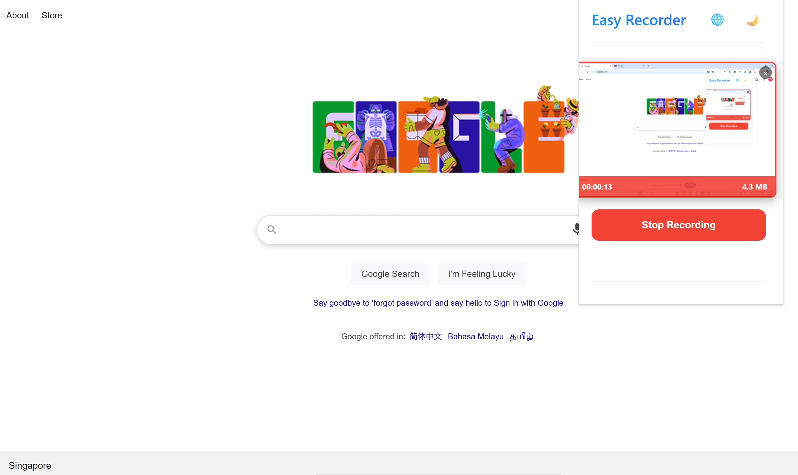
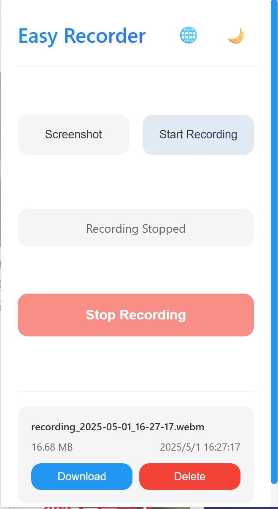

# Easy Recorder | 轻松录屏

A modern, elegant Chrome extension for hassle-free screen recording | 一个现代、优雅的 Chrome 屏幕录制扩展

[English](#english) | [中文](#chinese)


## English

### Overview

Easy Recorder is a lightweight yet powerful Chrome extension that makes screen recording simple and efficient. With its modern interface and streamlined functionality, you can start recording your screen with just a few clicks.

### Features

- **One-Click Recording**: Start recording your screen instantly
- **High-Quality Output**: Records at 8 Mbps for crystal clear quality
- **Modern UI**: Clean, intuitive interface with dark mode support
- **Recording History**: Easily manage and access your previous recordings
- **Elegant Design**: Smooth animations and visual feedback
- **Responsive Layout**: Works perfectly across different screen sizes

### How to Use

1. **Installation**
   - Install from Chrome Web Store (link coming soon)
   - Or download and load as an unpacked extension

2. **Basic Usage**
   - Click the extension icon to open the popup
   - Select "Start Recording"
   - Choose the screen/window you want to record
   - Click the stop button when finished


### Recording Interface

The extension features a clean, modern interface with essential controls:






### Installation Guide

1. Clone this repository
2. Open Chrome and navigate to `chrome://extensions/`
3. Enable "Developer mode"
4. Click "Load unpacked" and select the extension directory

### Development

To modify or enhance the extension:

```bash
git clone https://github.com/ToBeWin/easy-recorder.git
cd easy-recorder
# Make your modifications
```

### License

MIT License - feel free to use and modify as needed.

---

## Chinese

### 概述

Easy Recorder 是一个轻量级但功能强大的 Chrome 屏幕录制扩展。通过其现代化的界面和精简的功能，您只需点击几下即可开始录制屏幕。

### 特点

- **一键录制**：即刻开始屏幕录制
- **高质量输出**：8 Mbps 的录制质量，确保清晰度
- **现代界面**：简洁直观的界面设计，支持深色模式
- **录制历史**：轻松管理和访问以往的录制内容
- **优雅设计**：流畅的动画效果和视觉反馈
- **响应式布局**：完美适配不同屏幕尺寸

### 使用方法

1. **安装**
   - 从 Chrome 网上应用店安装（链接即将推出）
   - 或下载后以开发者模式加载

2. **基本使用**
   - 点击扩展图标打开弹窗
   - 选择"开始录制"
   - 选择要录制的屏幕或窗口
   - 完成后点击停止按钮


### 录制界面

扩展程序采用简洁现代的界面设计，包含必要的控制选项：


### 安装指南

1. 克隆此仓库
2. 打开 Chrome 浏览器，访问 `chrome://extensions/`
3. 启用"开发者模式"
4. 点击"加载已解压的扩展程序"并选择扩展目录

### 开发说明

如需修改或增强扩展功能：

```bash
git clone https://github.com/ToBeWin/easy-recorder.git
cd easy-recorder
# 进行修改
```

### 开源协议

MIT 协议 - 可自由使用和修改。


## Contribution | 贡献

Feel free to submit issues and enhancement requests! | 欢迎提交问题和改进建议！