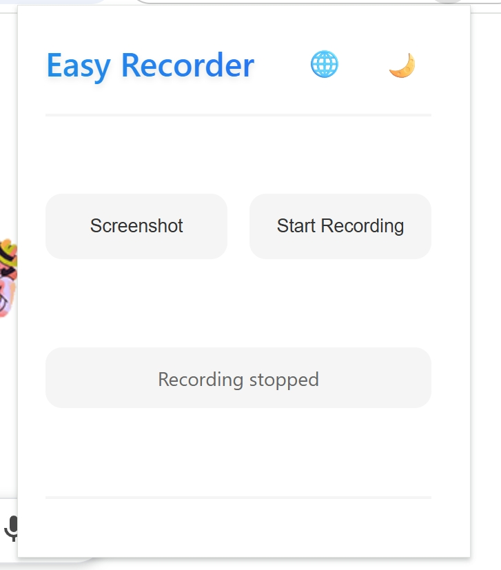
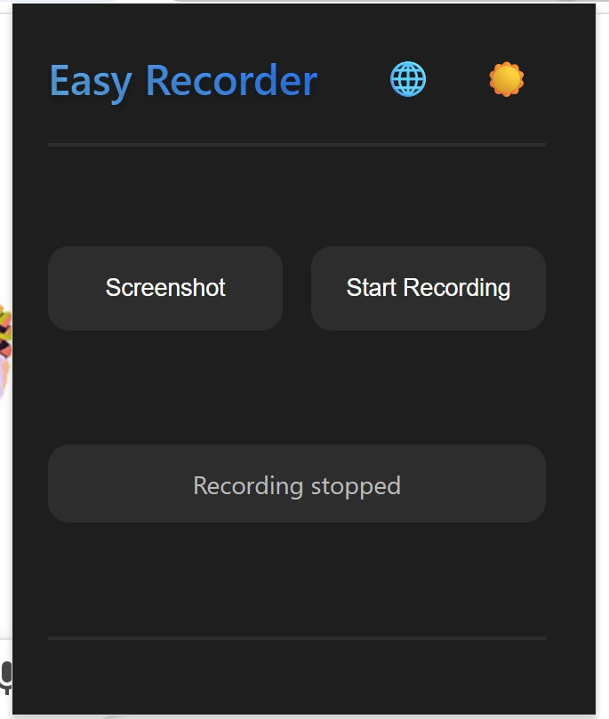

### Easy-Recorder 多功能录屏助手

#### Introduction
A browser plugin for screenshots and video recordings, it supports video preview during recording, real-time monitoring of recording progress and file size, and boasts a beautiful yet concise interface. Users can switch between themes, and the plugin is available in both Chinese and English, automatically adapting to the current operating system language.
一个截图和视频录制浏览器插件，支持视频录制中视频预览，实时查看录制进度和文件大小，界面优美，简洁。可以切换主题，支持中文和英语，插件自动根据当前操作系统语言进行适配。

